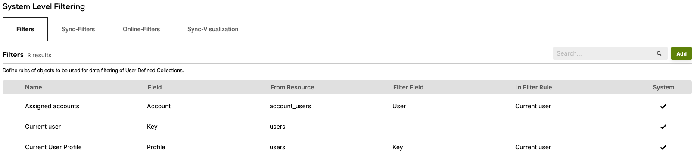
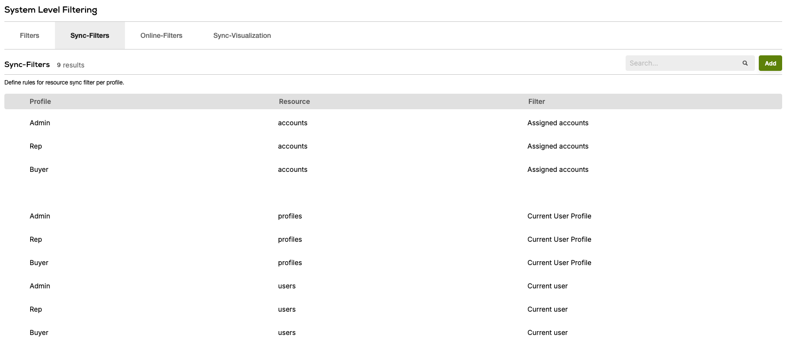
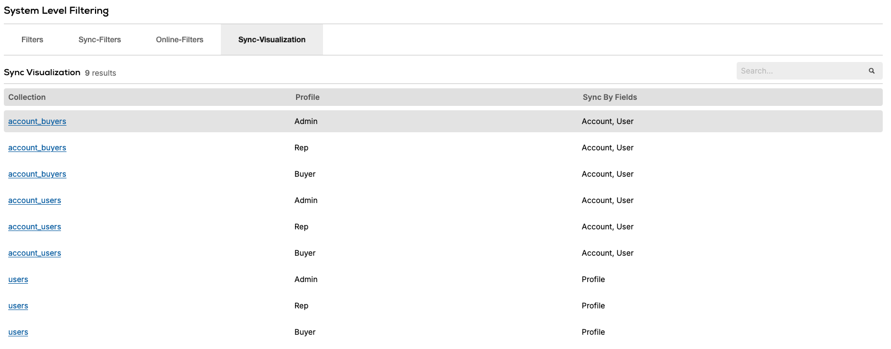
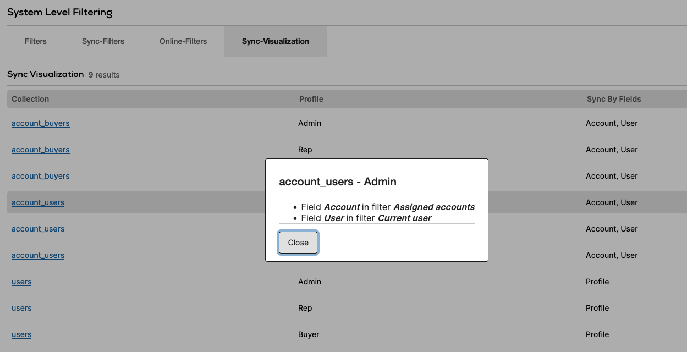

# Febula Architecture

## Overview
Febula allows administrators to manage sync rules for [Nebula](https://github.com/Pepperi-Addons/Nebula) via it's back office UI.  
Sync rules consist of [filters](#filters) and [profile filters](#profile-filters), which are used to determine how to sync each resource.

---

## Data Model
Filters are saved in the `filterObjects` table & profiles filters are saved in the `filterRules` table.

---

## Relations
Settings block relation is used to expose the UI in web app's settings menu.

---

## Topics
### Profile Filters 
#### High Level
Also called FilterRules, they point to the first filter object we need to use.  
The following are important to know fields:
```JSON
{
    EmployeeType: 1 | 2 | 3; // The employee type this rule applies to.
    Resource: string; // The resource we are filtering.
    Filter: string; // Reference to a filter we wish to apply.
    /**
     * The name of the rule set this rule applies to,
     * allows us to define different rules for sync modes (i.e. online & sync).
     */
    PermissionSet?: string;
}
```

#### Key Classes:
- `FilterRuleService` - Manages the filter rules.

---

### Filters
#### High Level
Filters define how to filter a resource, specifically which field to filter.  
A filter can point to a previous filter object, allowing us to chain filters.

```JSON
{
    Resource: string; // Name of the resource this filter... filters.
    Field: string; // ID of the inwards field, this is the field that the filter will return as a result.
    PreviousField?: string; // ID of the outward field.
    PreviousFilter?: string; // Key of the chained filter object.
}
```

Another way to think about it is in SQL terms, the result of a filter is:  
SELECT `Field` FROM `Resource` WHERE `PreviousField` IN [values returned from `PreviousFilter`].

#### Key Classes:
- `FilterObjectService` - Manages the filter objects.

---

### Basic Sync Rules
#### High Level
On [installation](https://github.com/Pepperi-Addons/febula/blob/307414583e57afe935c5b48fdeb37200a4e8c2df/server-side/installation.ts#L18) Febula upserts a set of basic filter for all employee types, those filters are used to filter the core resources:
- `Current user` - filters by the user's key.
- `Assigned Account` - filters by account, chained to `Current user` - meaning filters by which accounts points to a user.
- `Current User Profile` - similar to `Assigned account` but for profiles.


---

### Sync Rules Examples

#### User Reference
Let's start with a simple example, sync rules for a table that points to `users` resource:
```JSON
Scheme:
{
    Name: 'usersExample',
    Fields: {
        userRef: {
            Type: 'Resource',
            ApplySystemFilter: true,
            AddonUUID: CORE_RESOURCES_ADDON_UUID,
            Resource: 'users'
        }
    }
}

Filter Rule:
{
    EmployeeType: 1,
    Resource: 'usersExample',
    Filter: 'CurrentUser',
    PermissionSet: 'Sync'
}

Profile Filter:
{
    Key: 'CurrentUser',
    Resource: 'users',
    Field: 'Key'
}
```

#### Account Reference
In this example we will filter by the account that points to a user:
```JSON
Scheme:
{
    Name: 'accountsExample',
    Fields: {
        accountRef: {
            Type: 'Resource',
            ApplySystemFilter: true,
            AddonUUID: CORE_RESOURCES_ADDON_UUID,
            Resource: 'accounts'
        }
    }
}

Filter Rule:
{
    EmployeeType: 1,
    Resource: 'accountsExample',
    Filter: 'AssignedAccount',
    PermissionSet: 'Sync'
}

Profile Filter:
{
    Key: 'AssignedAccount',
    Resource: 'account_users', // This is an associative table between accounts and users,
    Field: 'account',          // we point to it via the account field
    PreviousField: 'user',     // and it chains to CurrentUser filter via the user field.
    PreviousFilter: 'CurrentUser'
},
{
    Key: 'CurrentUser',
    Resource: 'users',
    Field: 'Key'
}
```

#### Non Basic Filter 
In this example we will start will a table that points to `accountsExample` from the [previous example](#account-reference):
```JSON
Scheme:
{
    Name: 'NonBasicFilterExample',
    Fields: {
        accountsExampleRef: {
            Type: 'Resource',
            ApplySystemFilter: true,
            AddonUUID: ACCOUNT_EXAMPLE_ADDON_UUID,
            Resource: 'accountsExample'
        }
    }
}

Filter Rule:
{
    EmployeeType: 1,
    Resource: 'NonBasicFilterExample',
    Filter: 'NonBasicFilter',
    PermissionSet: 'Sync'
}

Profile Filter:
{
    Key: 'NonBasicFilter',
    Resource: 'accountsExample',
    Field: 'Key',
    PreviousField: 'accountRef',
    PreviousFilter: 'AssignedAccount'
},
{
    Key: 'AssignedAccount',
    Resource: 'account_users',
    Field: 'account',
    PreviousField: 'user',
    PreviousFilter: 'CurrentUser'
},
{
    Key: 'CurrentUser',
    Resource: 'users',
    Field: 'Key'
}
```

---

### UI
#### High Level
Febula's UI consist of a settings tab component, it loads all the data from the server and passes it to its sub-components.

Tabs:
- `Filter` - lists all the filters.


- `Sync-Filters` - lists all the profile filters of `Sync` permission set.


- `Online-Filters` - lists all the profile filters of `Online` permission set.

- `Sync-Visualization` - visualizes the sync rules by listing resources per employee type and presents the fields involved in the sync rules.



#### Key Classes:
- `SettingsTabsComponent`.
- `FiltersListComponent` - lists filters.
- `FilterFormComponent` - used to create and edit filters.
- `ProfileFiltersListComponent` - lists profile filters.
- `ProfileFiltersFormComponent` - used to create and edit profile filters.
- `SyncVisualizationComponent` - visualizes the sync rules.

---